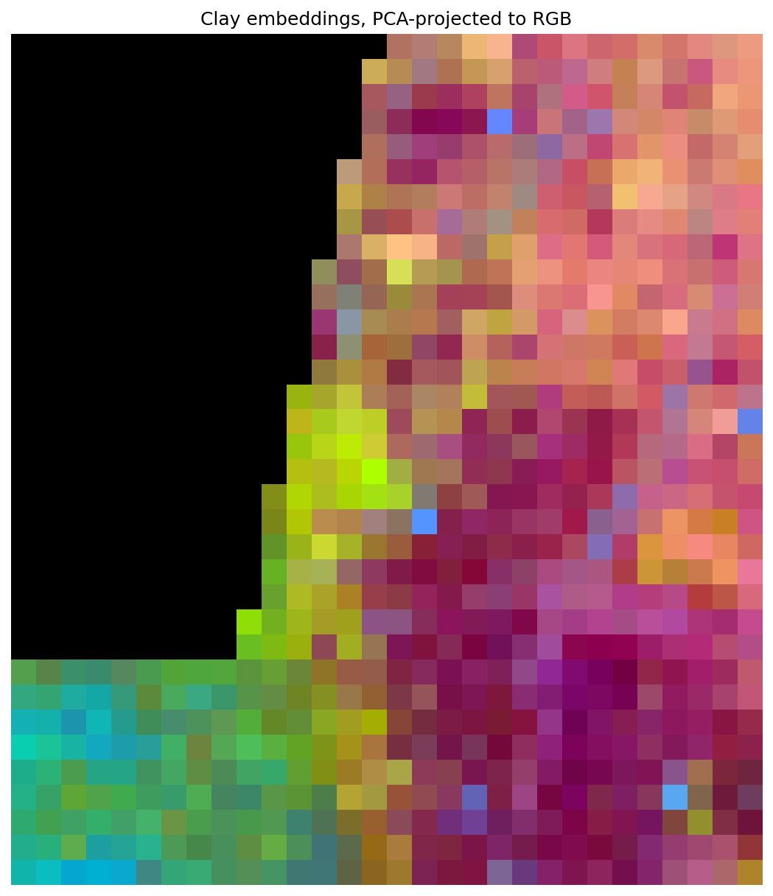
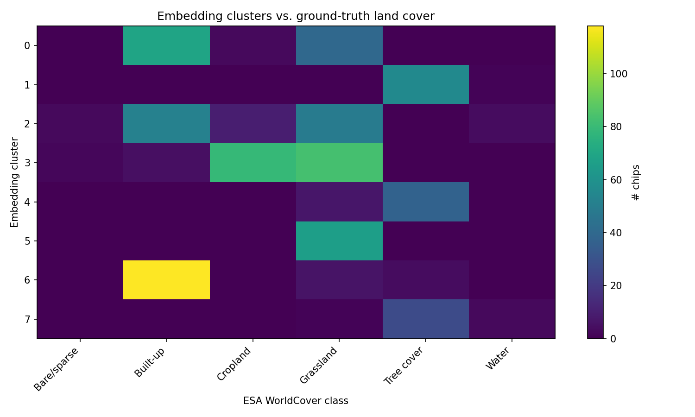
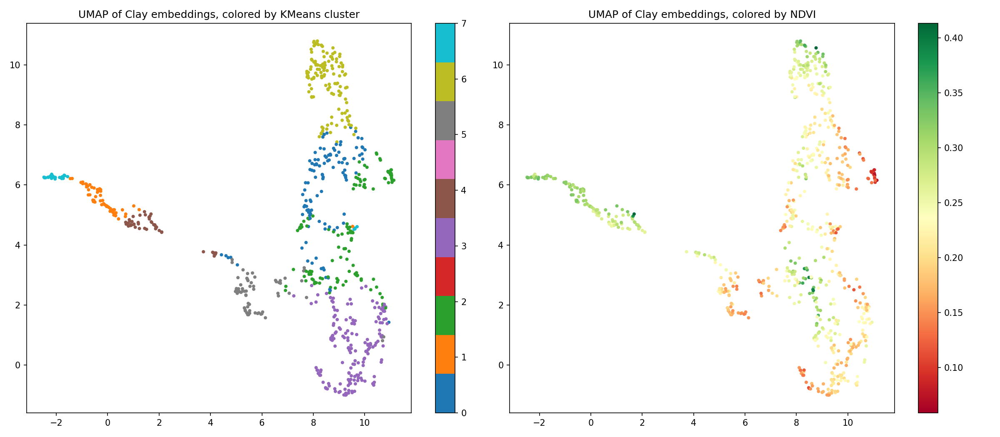
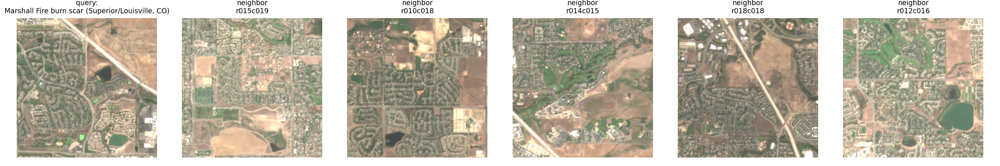

# Front Range Satellite Embeddings

**Live map:** [zanderhirman08.github.io/SATEMB](https://zanderhirman08.github.io/SATEMB/)

An unsupervised, embedding-only map of the Colorado Front Range (Boulder → Denver), built to
answer a specific question: **what does a satellite-imagery foundation model's embedding vector
actually contain?** Not "can I use it," but "what's really in there" — is it mostly vegetation?
Built-up-ness? Something texture-based that doesn't reduce to a spectral index at all?


_Every chip colored by PCA-projecting its 1024-dim [Clay v1.5](https://github.com/Clay-foundation/model)
embedding down to RGB, with zero supervision — no labels, no land-cover data, nothing but the
raw embedding vectors. The black wedge in the upper-left is outside both Sentinel-2 tiles used
for the mosaic (a real coverage gap, not a rendering issue)._

## Why this AOI

The bounding box (`stac_utils.FRONT_RANGE_BBOX`) deliberately packs in a lot of different kinds
of ground truth within one Sentinel-2 mosaic: Denver's street grid, Boulder's suburban fringe,
irrigated farmland out on the plains, forested foothills climbing toward the Rockies, Boulder
Reservoir, and the scar of the December 2021 Marshall Fire near Superior/Louisville. If an
embedding space is capturing anything real, these should end up visually and numerically distinct.

## Method

1. **[`01_fetch_and_chip.ipynb`](notebooks/01_fetch_and_chip.ipynb)** — search
   [Microsoft Planetary Computer](https://planetarycomputer.microsoft.com/) for low-cloud
   Sentinel-2 L2A scenes over the AOI (the bbox straddles two MGRS tiles, so it takes the
   least-cloudy scene from each), reproject to UTM 13N, and cut into a grid of 224×224px
   (2.24km) chips — 725 of them survive a nodata filter.
2. **[`02_generate_embeddings.ipynb`](notebooks/02_generate_embeddings.ipynb)** — run every chip
   through [Clay v1.5](https://github.com/Clay-foundation/model), a metadata-conditioned
   foundation model: it takes not just pixels but the physical wavelength of each band and a
   rough time/location, and returns a 1024-dim embedding per chip.
3. **[`03_analyze_and_export.ipynb`](notebooks/03_analyze_and_export.ipynb)** — the actual
   analysis:
   - PCA-project embeddings to RGB (the map's default color mode)
   - correlate PCA components against hand-computed NDVI / NDBI / NDWI (interpretable band math)
   - cluster the embeddings (KMeans) and check agreement against
     [ESA WorldCover](https://esa-worldcover.org/en) 10m land cover — an external, human-labeled
     signal the model never saw
   - pick a handful of chips (forest, urban, water, the Marshall Fire scar) and inspect their
     nearest neighbors in embedding space against true-color thumbnails
   - export the static `docs/data/chips.geojson` + `docs/data/embeddings.bin` the live map reads
4. **[`docs/`](docs/)** — a static [MapLibre GL JS](https://maplibre.org/) map, no backend: toggle
   between PCA-projection, cluster, and continuous-similarity-heatmap coloring; click any chip to
   compute its nearest neighbors, entirely client-side, against the real 1024-dim vectors.
5. **[`04_elevation_correlation.ipynb`](notebooks/04_elevation_correlation.ipynb)** — a lighter,
   CPU-only follow-up: fetches USGS 3DEP elevation over the AOI and checks whether any PCA
   component (extended past the top 3 examined in notebook 03) or the embedding clusters
   correlate with terrain, which Clay never saw as an input. Reads directly from the committed
   `docs/data/` files, so it needs no GPU and no Colab Drive round-trip.
6. **[`analysis/`](analysis/)** — small follow-up experiments that run entirely against the
   committed `docs/data/` files, no Colab needed at all (e.g. `embedding_arithmetic.js`, a
   word2vec-style vector-arithmetic test — see the [Analysis Log](https://zanderhirman08.github.io/SATEMB/log.html)).

## What Clay's embeddings actually encode

**PCA is dominated by one axis.** The top-3 components explain 82.3% of embedding variance, but
almost all of that is PC1 alone (59.4%); PC2 adds 14.2%, PC3 a further 8.6%. Most of what
distinguishes these chips from each other, embedding-wise, lives on a single dimension.

**That dominant axis tracks human development, not "vegetation" cleanly.**

| index | PC1 | PC2 | PC3 |
|---|---|---|---|
| NDVI | −0.55 | −0.05 | −0.14 |
| NDBI | 0.61 | 0.66 | −0.14 |
| NDWI | 0.34 | −0.02 | 0.24 |

PC1 is negatively correlated with vegetation and positively with built-up-ness *and* water —
read literally, it's closer to an "anything-that-isn't-bare-dry-land" axis than a pure
vegetation axis. PC2 is even more strongly tied to NDBI (0.66) but essentially uncorrelated with
NDVI/NDWI, suggesting it's picking up a *different* flavor of built-up-ness — density or texture,
maybe — orthogonal to how green a chip is. PC3 correlates weakly with everything, which likely
means it's capturing something a simple band-ratio index can't describe: texture, spatial
context, or a trace of Clay's time/location conditioning.

**Clusters agree with real land cover, unevenly.** KMeans-8 over the raw 1024-dim embeddings
scores an Adjusted Rand Index of **0.275** against ESA WorldCover (0 = chance, 1 = perfect;
matched all 725/725 chips). That's a real, well-above-chance signal, not a coincidence — and
the breakdown explains why it isn't higher: one cluster is *almost entirely* "Built-up" chips,
another is *almost entirely* "Tree cover," but "Cropland" and "Grassland" bleed across several
clusters rather than each getting a clean cluster of their own.



That's a sensible failure mode, not a broken pipeline: cropland and grassland can look nearly
identical spectrally in a single snapshot (their spectral difference is mostly seasonal/temporal
— irrigation timing, crop calendar — which one Sentinel-2 date can't capture), while "built-up"
and "forest" are visually and spectrally distinct enough to separate cleanly even from a single
date.



The embedding space itself is well-organized: UMAP shows discrete, well-separated blobs (left
panel), and coloring the same layout by NDVI (right panel) produces a clean, continuous
gradient across the manifold rather than random speckle — the geometry of the embedding space
lines up with a real physical quantity it was never told about.

**Nearest neighbors mostly make sense — with one honest miss.** Querying the highest-NDVI,
highest-NDBI, and highest-NDWI chips each returns neighbors that are visually the same kind of
place (forest near forest, dense urban near dense urban, water near water). The one query aimed
at the Marshall Fire burn scar (Superior/Louisville) returned suburban-edge/grassland neighbors
that don't look distinctly "burned":



Worth stating plainly rather than glossing over: by the 2024 imagery used here, the scar is
~2.5 years regrown, and a chip centroid nearest the fire's location isn't guaranteed to land on
the most heavily burned pixels. Whether that's "Clay doesn't retain a burn signature this long"
or "this particular chip missed the scar" is exactly the kind of question this method surfaces
but can't answer by itself — a real limitation of a single 2.24km-chip, single-date snapshot, not
a marketing footnote.

## Running it yourself

This repo splits cleanly into "author locally, run in Colab": everything here is already
written, but generating real embeddings needs a GPU, which is why the actual execution happens
in Google Colab rather than on this machine.

1. Push this repo to GitHub (see below).
2. Open each notebook directly from GitHub in Colab — no upload needed, one tab per notebook:
   ```
   https://colab.research.google.com/github/ZanderHirman08/SATEMB/blob/main/notebooks/01_fetch_and_chip.ipynb
   ```
   (swap the filename for `02_generate_embeddings.ipynb`, then `03_analyze_and_export.ipynb`)
3. `REPO_URL` in each notebook's first cell is already set to this repo.
4. Runtime → Change runtime type → **T4 GPU**, for each notebook.
5. Run 01 → 02 → 03, top to bottom, in order. **Each notebook you open this way gets its own
   fresh Colab VM**, so they hand off intermediate files (`chip_pixels.npy`, `embeddings.npy`,
   etc.) through Google Drive rather than local disk — expect a one-time Drive-access prompt per
   notebook. Notebook 03's last cell writes the real `docs/data/chips.geojson`,
   `docs/data/embeddings.bin`, and `docs/figures/*.png` into the local repo checkout on its VM.
6. Commit and push those files from inside Colab (a GitHub personal access token as a Colab
   Secret works well — see the token-based `git push` snippet in this repo's history/commits for
   the exact cell), since downloading and re-uploading a binary `.bin` file by hand is error-prone.
7. Enable GitHub Pages: repo Settings → Pages → Deploy from branch → `main` / `/docs`.
8. Optional, CPU-only: run `04_elevation_correlation.ipynb` afterward for the terrain-correlation
   follow-up. It reads directly from the just-committed `docs/data/` files, so no GPU or Drive
   round-trip is needed — a plain (non-GPU) Colab runtime is enough.

## Repo layout

```
notebooks/    the actual pipeline (run in Colab, in order 01 -> 02 -> 03)
src/          helper modules the notebooks import (STAC search, Clay wrapper, PCA/export)
docs/         the static site (GitHub Pages source): map, generated data, and figures
analysis/     lightweight follow-up experiments that run locally against docs/data/
              (no Colab needed -- the full embeddings are already committed there)
```

## Credits

Imagery: [Sentinel-2](https://sentinel.esa.int/web/sentinel/missions/sentinel-2) (ESA/Copernicus)
via [Microsoft Planetary Computer](https://planetarycomputer.microsoft.com/). Land cover:
[ESA WorldCover](https://esa-worldcover.org/en). Model:
[Clay Foundation Model](https://github.com/Clay-foundation/model) v1.5. Map:
[MapLibre GL JS](https://maplibre.org/) + [Esri World Imagery](https://www.arcgis.com/home/item.html?id=10df2279f9684e4a9f6a7f08febac2a9).
